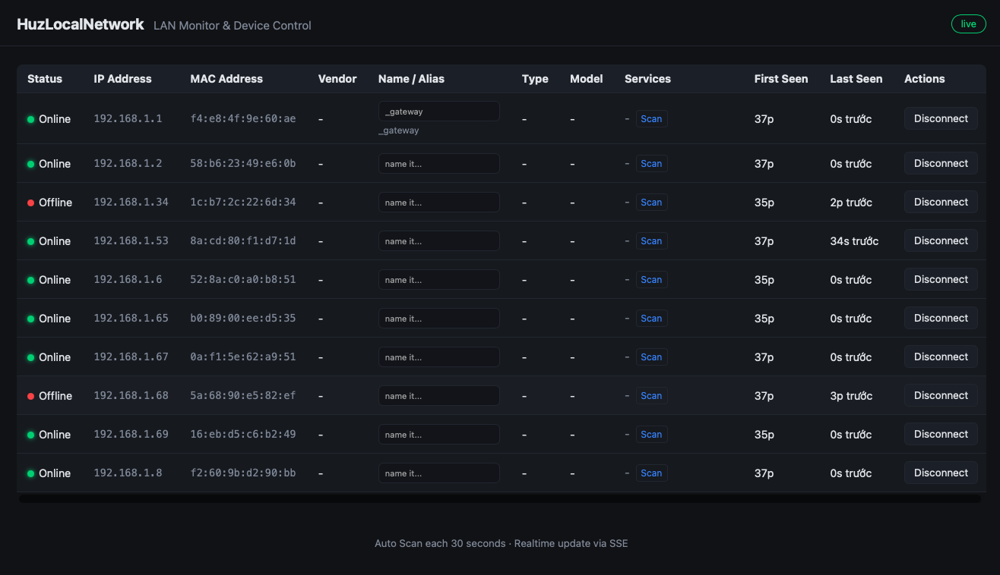

# HuzLocalNetwork-linux

LAN device monitor with ARP presence discovery, local device control, and
optional identity/service enrichment.

## Discovery behavior

- ARP scans run on the configured interval and are the source of online/offline state.
- Reverse DNS runs in the background every five minutes with a one-second timeout per host.
- UPnP/SSDP discovery runs in the background every 30 minutes to collect a device's friendly name, manufacturer, and model when advertised.
- The **Scan** action probes only a fixed set of common TCP service ports for that selected device. It uses short timeouts and does not run automatically in the ARP loop.

Operate the monitor and use active service scans only on networks and devices you own or are authorized to assess.

## Screenshot

	

